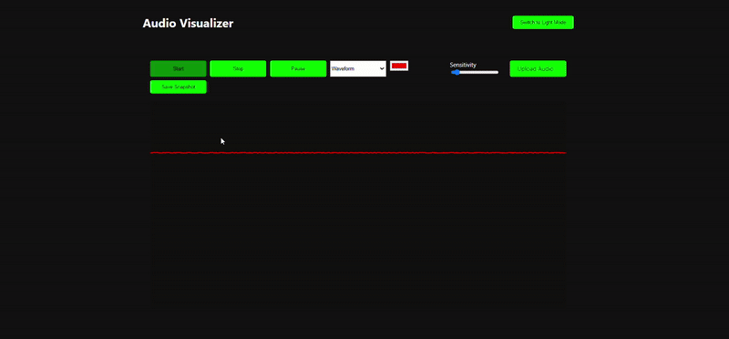
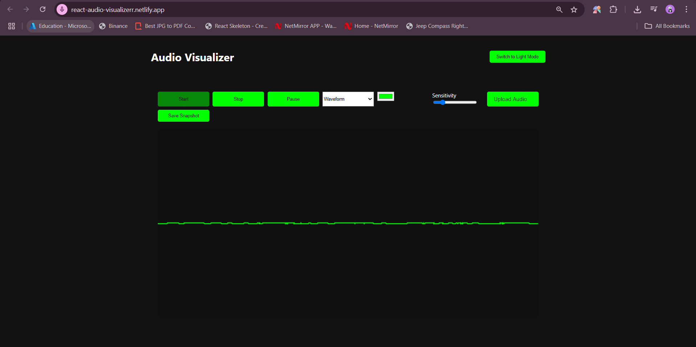
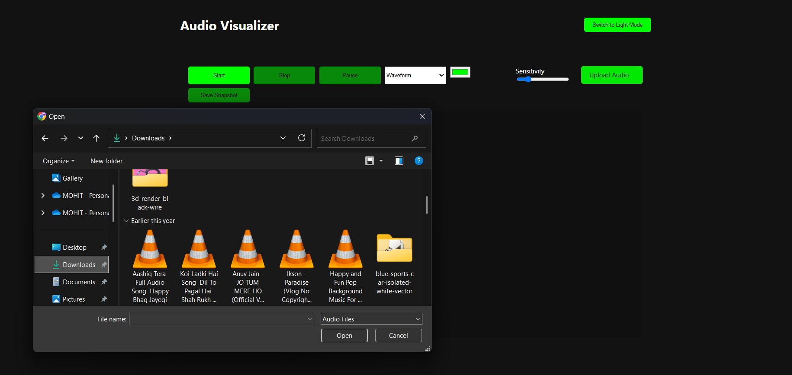
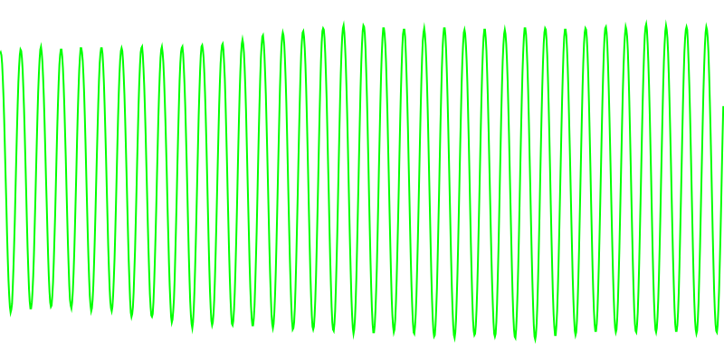
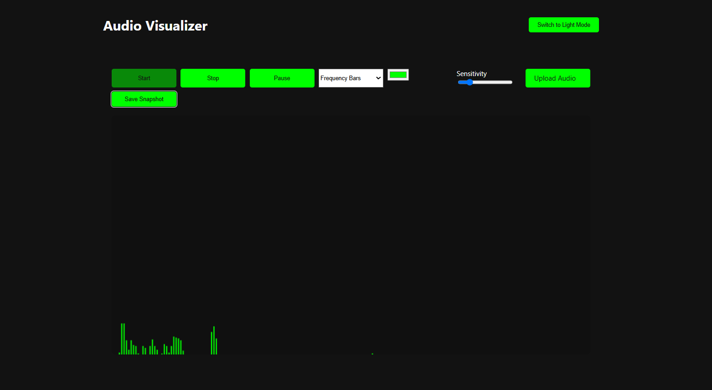
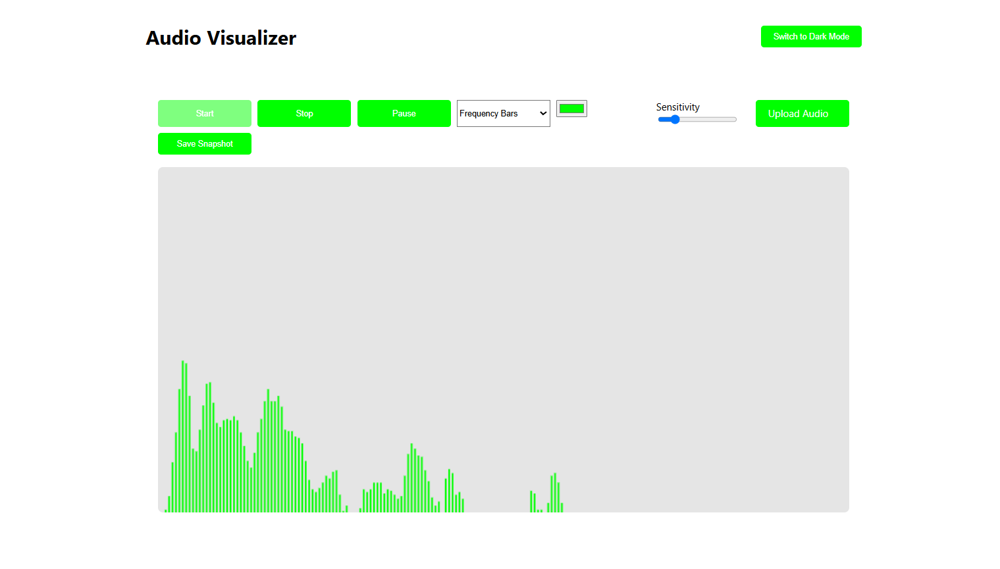
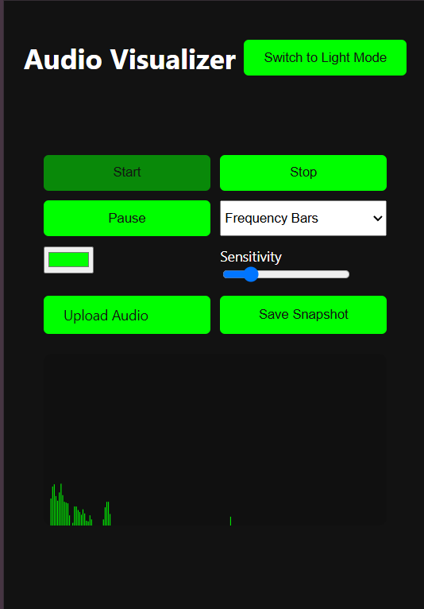

# React Audio Visualizer 🎵

An interactive audio visualizer built with React that provides real-time visualization of audio input from both microphone and uploaded audio files.



## ✨ Features

- 🎤 Real-time microphone input visualization
- 📁 Audio file upload support (MP3, WAV)
- 🌊 Multiple visualization modes (Waveform, Frequency Bars)
- 🎨 Customizable visualization colors
- 🔊 Adjustable sensitivity controls
- ⏯️ Pause/Resume functionality
- 📸 Snapshot saving capability
- 🎹 Keyboard controls
- ♿ Accessibility features

## 🚀 Live Demo

Check out the live demo: [React Audio Visualizer](https://react-audio-visualizerr.netlify.app/)

## 🛠️ Technologies Used

- React
- Vite
- Styled Components
- Framer Motion

## 📥 Installation

1. Clone the repository:
   ```bash
   git clone https://github.com/Mohit138928/react-audio-visualizer.git
   ```

2. Navigate to the project directory:
   ```bash
   cd react-audio-visualizer
   ```

3. Install dependencies:
   ```bash
   npm install
   ```

4. Start the development server:
   ```bash
   npm run dev
   ```

## 💡 Usage

### Microphone Input
1. Click the "Start" button to begin microphone visualization
2. Adjust sensitivity and color as needed
3. Switch between visualization modes
4. Click "Stop" to end visualization



### Audio File Upload
1. Click "Upload Audio" to select an audio file
2. Use play/pause controls to manage playback
3. Visualize audio in different modes
4. Take snapshots of interesting patterns



### Keyboard Controls
- Space: Pause/Resume
- Enter: Start/Stop
- ↑/↓: Adjust sensitivity

## 🎨 Visualization Modes

### Waveform
Displays audio as a continuous wave pattern


### Frequency Bars
Shows audio frequency distribution as vertical bars


## ⚙️ Configuration

Customize visualization parameters in the UI:
- Color selection
- Sensitivity adjustment
- Visualization mode selection

## 🤝 Contributing

1. Fork the repository
2. Create your feature branch (`git checkout -b feature/AmazingFeature`)
3. Commit your changes (`git commit -m 'Add some AmazingFeature'`)
4. Push to the branch (`git push origin feature/AmazingFeature`)
5. Open a Pull Request

## 📝 License

This project is licensed under the MIT License - see the [LICENSE](LICENSE) file for details.

## 📸 Screenshots

### Dark Mode


### Light Mode


### Mobile View


## 🔧 Troubleshooting

### Common Issues
1. Microphone access denied
   - Solution: Allow microphone access in browser settings

2. Audio playback issues
   - Solution: Check browser compatibility and audio file format

3. Performance issues
   - Solution: Adjust sensitivity or reduce canvas size

## 📱 Mobile Support

The application is fully responsive and works on mobile devices:
- Touch-friendly controls
- Optimized layout for small screens
- Portrait and landscape support

## 🔜 Future Enhancements

- [ ] Additional visualization modes
- [ ] Audio effects processing
- [ ] Playlist support
- [ ] Recording capability
- [ ] Social sharing integration

## 📫 Contact


Project Link: [https://github.com/Mohit138928/react-audio-visualizer.git](https://github.com/Mohit138928/react-audio-visualizer.git)